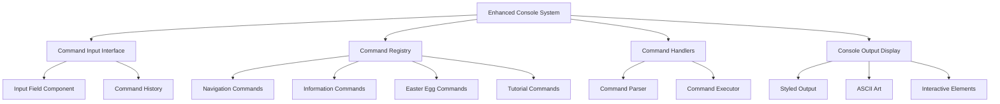
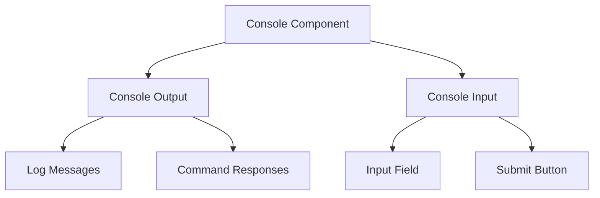
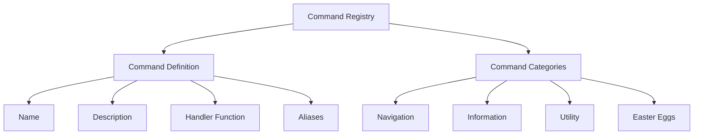
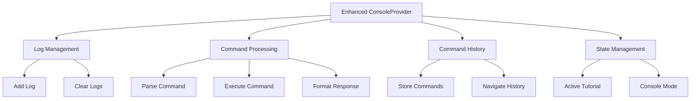

# Interactive Console Enhancement Plan

This document outlines the plan to enhance the portfolio website's console with command input functionality, navigation commands, information commands, and fun easter eggs to make the portfolio more engaging.

## Overview



## Detailed Implementation Plan

### 1. Enhance Console Component Structure



- Modify the existing Console component to include an input section
- Keep the current log display functionality
- Add a new input field and submit button at the bottom
- Style the input area to match the terminal aesthetic

### 2. Create Command Registry System



- Create a registry to store all available commands
- Organize commands into categories for easier management
- Define a standard interface for command handlers
- Include help text and examples for each command

### 3. Implement Core Command Handlers

#### Navigation Commands

- `cd home` - Navigate to the home section
- `cd about` - Navigate to the about section
- `cd skills` - Navigate to the skills section
- `cd portfolio` - Navigate to the portfolio section
- `cd contact` - Navigate to the contact section

#### Information Commands

- `help` - Display available commands
- `ls` - List sections or content
- `cat about.md` - Display about information
- `cat skills.json` - Display skills information
- `cat experience.json` - Display experience information
- `cat contact.json` - Display contact information
- `whoami` - Display a brief introduction

#### Utility Commands

- `clear` - Clear the console
- `history` - Show command history
- `echo [text]` - Display text in the console
- `open [url]` - Open a link in a new tab

### 4. Add Easter Eggs and Interactive Elements

#### Easter Egg Commands

- `sudo make me a sandwich` - Respond with "Nice try!"
- `konami` - Trigger a special animation
- `matrix` - Display a matrix-like animation
- `coffee` - ASCII art coffee cup
- `rickroll` - You know what this does...

#### Interactive Tutorial

- `tutorial` - Start an interactive tour of your portfolio
- `tutorial [section]` - Start a tutorial for a specific section
- Guide users through your portfolio with step-by-step instructions

### 5. Enhance Console Provider



- Extend the current ConsoleProvider to handle command processing
- Add command history functionality
- Implement state management for interactive features
- Create methods for command execution and response formatting

### 6. Technical Implementation Details

#### Console Input Component

```tsx
// New component for command input
const ConsoleInput = () => {
  const [input, setInput] = useState('');
  const { executeCommand } = useConsole();
  
  const handleSubmit = (e: React.FormEvent) => {
    e.preventDefault();
    if (input.trim()) {
      executeCommand(input);
      setInput('');
    }
  };
  
  return (
    <form onSubmit={handleSubmit} className="flex border-t border-border">
      <span className="text-primary px-2 py-1">$</span>
      <input
        type="text"
        value={input}
        onChange={(e) => setInput(e.target.value)}
        className="flex-1 bg-transparent border-none outline-none text-foreground px-1 py-1"
        placeholder="Type a command..."
      />
      <button type="submit" className="sr-only">Execute</button>
    </form>
  );
};
```

#### Command Registry

```tsx
// Command registry structure
interface Command {
  name: string;
  description: string;
  usage: string;
  aliases?: string[];
  execute: (args: string[], console: ConsoleContextType) => void;
}

// Example command implementation
const helpCommand: Command = {
  name: 'help',
  description: 'Display available commands',
  usage: 'help [command]',
  aliases: ['?'],
  execute: (args, console) => {
    if (args.length > 0) {
      // Show help for specific command
      const commandName = args[0];
      const command = findCommand(commandName);
      if (command) {
        console.log(`Command: ${command.name}`);
        console.log(`Description: ${command.description}`);
        console.log(`Usage: ${command.usage}`);
      } else {
        console.error(`Unknown command: ${commandName}`);
      }
    } else {
      // Show all commands
      console.log('Available commands:');
      commandRegistry.forEach(cmd => {
        console.log(`${cmd.name} - ${cmd.description}`);
      });
    }
  }
};
```

#### Enhanced ConsoleProvider

```tsx
// Extended ConsoleProvider with command functionality
export function ConsoleProvider({ children }: ConsoleProviderProps) {
  const [logs, setLogs] = useState<LogMessage[]>([]);
  const [commandHistory, setCommandHistory] = useState<string[]>([]);
  const [historyIndex, setHistoryIndex] = useState(-1);
  
  // Existing log methods...
  
  const executeCommand = useCallback((commandStr: string) => {
    // Add command to history
    setCommandHistory(prev => [...prev, commandStr]);
    setHistoryIndex(-1);
    
    // Log the command
    log(`$ ${commandStr}`);
    
    // Parse command and arguments
    const [command, ...args] = commandStr.trim().split(/\s+/);
    
    // Find and execute command
    const cmd = findCommand(command);
    if (cmd) {
      try {
        cmd.execute(args, { log, warn, error, success });
      } catch (err) {
        error(`Error executing command: ${err.message}`);
      }
    } else {
      error(`Command not found: ${command}`);
    }
  }, [log, warn, error, success]);
  
  // Command history navigation
  const getPreviousCommand = useCallback(() => {
    if (historyIndex < commandHistory.length - 1) {
      const newIndex = historyIndex + 1;
      setHistoryIndex(newIndex);
      return commandHistory[commandHistory.length - 1 - newIndex];
    }
    return null;
  }, [commandHistory, historyIndex]);
  
  const getNextCommand = useCallback(() => {
    if (historyIndex > 0) {
      const newIndex = historyIndex - 1;
      setHistoryIndex(newIndex);
      return commandHistory[commandHistory.length - 1 - newIndex];
    } else if (historyIndex === 0) {
      setHistoryIndex(-1);
      return '';
    }
    return null;
  }, [commandHistory, historyIndex]);
  
  // Provide extended context
  return (
    <ConsoleContext.Provider value={{ 
      logs, 
      log, 
      warn, 
      error, 
      success, 
      executeCommand, 
      getPreviousCommand, 
      getNextCommand,
      commandHistory
    }}>
      {children}
    </ConsoleContext.Provider>
  );
}
```

## Implementation Phases

### Phase 1: Core Command Input

1. Update Console component with input field
2. Extend ConsoleProvider with command execution
3. Implement basic command registry
4. Add core commands (help, clear, echo)

### Phase 2: Navigation and Information Commands

1. Implement navigation commands (cd)
2. Add information display commands (cat, ls, whoami)
3. Create formatted output for information commands
4. Link commands to existing portfolio data

### Phase 3: Easter Eggs and Interactive Elements

1. Add fun easter egg commands
2. Implement ASCII art responses
3. Create interactive tutorial system
4. Add special effects for certain commands
