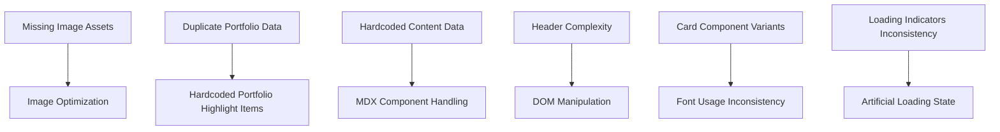

# Portfolio Website Code Review Action Plan

## Overview

This document outlines a prioritized action plan for addressing the issues identified in the code review of the Next.js portfolio website. The plan categorizes issues by severity, identifies dependencies between issues, and recommends a phased implementation sequence.

## Issue Prioritization

Issues have been categorized by severity regardless of their category:

### Critical Issues
1. **Missing Image Assets** (Issue 2.1) - Most project images are missing and placeholders are used instead. This directly impacts user experience and site appearance.
2. **Duplicate Portfolio Data** (Issue 3.1) - Inconsistent data sources (`portfolio.ts` and `portfolio.json`) could lead to confusion and maintenance issues.
3. **Missing CV File** (Issue 3.7) - The "download_cv.pdf" link points to a non-existent file, resulting in a broken download link.

### High Priority Issues
1. **Image Optimization Issues** (Issues 2.4, 2.5, 2.6) - Missing `sizes` attributes and `priority` props on images affect performance and loading experience.
2. **Artificial Loading State** (Issue 3.12) - Unnecessary loading simulation in SkillsSection creates artificial delays.
3. **Hardcoded Portfolio Highlight Items** (Issue 3.13) - Using indices for selection is brittle and could break if order changes.
4. **Header Complexity** (Issue 3.16) - Large component with multiple concerns reduces maintainability.
5. **DOM Manipulation** (Issue 3.17) - Direct DOM manipulation creates tight coupling between components.
6. **Accessibility Concerns** (Issue 3.7) - Keyboard shortcuts, focus management, and color contrast issues affect usability.

### Medium Priority Issues
1. **Font Usage Inconsistency** (Issue 1.1) - Inconsistent application of fonts affects visual coherence.
2. **Card Component Variants** (Issue 1.2) - Multiple similar card components with slight differences.
3. **Loading Indicators Inconsistency** (Issue 1.3) - Different loading states used across the application.
4. **Component Memoization** (Issue 2.2) - Potentially unnecessary memoization adding complexity.
5. **Incomplete Sound Feature** (Issue 3.2) - Sound manager with empty URLs and disabled play method.
6. **Analytics Placeholder** (Issue 3.3) - Non-functional analytics with placeholder IDs.
7. **Hardcoded Content Data** (Issue 3.4) - Content hardcoded in TypeScript files making updates difficult.
8. **MDX Component Handling** (Issue 3.5) - Redundant MDX component configuration.
9. **Type Safety Issues** (Issue 3.6) - Use of `any` type in components.
10. **Client Components** (Issue 3.19) - Unnecessary client components that could be server components.

### Low Priority Issues
1. **CSS/Tailwind Performance** (Issue 2.3) - Minor issue with CSS-in-JS in Footer.
2. **Console Logging** (Issue 3.8) - Excessive logging in production builds.
3. **Unused Dependency** (Issue 3.9) - `typed.js` listed as dependency but not used.
4. **Unused Data File** (Issue 3.10) - Unused `src/lib/data/blog.ts` file.
5. **Unused Utility Function** (Issue 3.11) - Unused `throttle` function in utils.ts.
6. **Commented-Out Style Changes** (Issue 3.14) - Comments adding noise to the code.
7. **Unnecessary Alias** (Issue 3.15) - Unnecessary `ShadCard` alias for `Card` component.
8. **Import Paths** (Issue 3.18) - Inconsistent import paths using relative paths instead of aliases.

## Dependencies Between Issues

Key dependencies between issues:

## Action Plan Sequence

Based on the prioritization and dependencies, here's the recommended sequence for implementing fixes:

### Phase 1: Critical Fixes

1. **Resolve Duplicate Portfolio Data** (Issue 3.1)
   - Determine the single source of truth (likely `portfolio.ts`)
   - Consolidate all necessary data into that file
   - Delete the unused `portfolio.json`
   - Ensure consistent data structure

2. **Add Missing Image Assets** (Issue 2.1)
   - Add available assets to the appropriate directories
   - Source or create missing assets
   - Update image paths in portfolio data
   - Ensure all images are properly optimized

3. **Add Missing CV File** (Issue 3.7)
   - Add the CV file to the public directory
   - Or remove the download button if CV is not available

### Phase 2: High Priority Improvements

1. **Fix Image Optimization Issues** (Issues 2.4, 2.5, 2.6)
   - Add appropriate `sizes` attributes to all `Image` components
   - Set `priority` prop for above-the-fold images
   - Ensure proper lazy loading for below-the-fold images

2. **Refactor Header Component** (Issues 3.16, 3.17)
   - Extract functionalities into separate custom hooks
   - Replace direct DOM manipulation with React state
   - Create smaller sub-components for better organization

3. **Fix Hardcoded Portfolio Highlight Items** (Issue 3.13)
   - Add `isHighlighted` property to `PortfolioItem` interface
   - Update selection logic to use this property instead of indices

4. **Remove Artificial Loading State** (Issue 3.12)
   - Remove loading simulation logic from SkillsSection
   - Replace with AnimateOnScroll for a smoother effect

5. **Address Accessibility Concerns** (Issue 3.7)
   - Review keyboard shortcuts for potential conflicts
   - Improve focus management
   - Verify color contrast ratios
   - Test keyboard navigation

### Phase 3: Medium Priority Improvements

1. **Standardize Font Usage** (Issue 1.1)
   - Define clear strategy for font application
   - Apply consistent font styles across components

2. **Consolidate Card Components** (Issue 1.2)
   - Review all card implementations
   - Standardize on base Card component
   - Extend for specific needs rather than creating separate components

3. **Standardize Loading Indicators** (Issue 1.3)
   - Choose one primary loading style
   - Apply it uniformly across the application

4. **Improve Type Safety** (Issue 3.6)
   - Replace `any` types with proper interfaces
   - Define proper types for all components

5. **Decide on Sound Feature** (Issue 3.2)
   - Either complete the feature by adding sound files
   - Or remove the SoundManager and all calls to it

6. **Fix Analytics** (Issue 3.3)
   - Replace placeholder IDs with actual tracking IDs
   - Or remove the Analytics component if not needed

7. **Optimize MDX Component Handling** (Issue 3.5)
   - Simplify MDX component configuration
   - Remove redundant hooks or imports

8. **Review Component Memoization** (Issue 2.2)
   - Identify actual performance bottlenecks
   - Remove unnecessary memoization

9. **Convert Client Components to Server Components** (Issue 3.19)
   - Review each component with 'use client'
   - Convert to Server Components where possible

10. **Consider Content Management Approach** (Issue 3.4)
    - Evaluate migrating hardcoded content to MDX files
    - Or implement a headless CMS solution

### Phase 4: Low Priority Cleanup

1. **Remove Unused Code**
   - Remove unused dependency (`typed.js`) (Issue 3.9)
   - Delete unused data file (`src/lib/data/blog.ts`) (Issue 3.10)
   - Remove unused utility function (`throttle`) (Issue 3.11)

2. **Code Cleanup**
   - Remove commented-out style changes (Issue 3.14)
   - Remove unnecessary alias (`ShadCard`) (Issue 3.15)
   - Standardize import paths (Issue 3.18)
   - Optimize CSS/Tailwind usage (Issue 2.3)
   - Conditionally disable non-essential console logs (Issue 3.8)

## Implementation Strategy

For each phase:

1. **Assessment**: Thoroughly review the issues and their interdependencies
2. **Planning**: Create detailed tasks for each issue
3. **Implementation**: Make the necessary code changes
4. **Testing**: Verify that the changes resolve the issues without introducing new ones
5. **Review**: Conduct a code review to ensure quality and consistency

This phased approach ensures that the most critical issues are addressed first, while also considering the dependencies between issues to minimize rework.